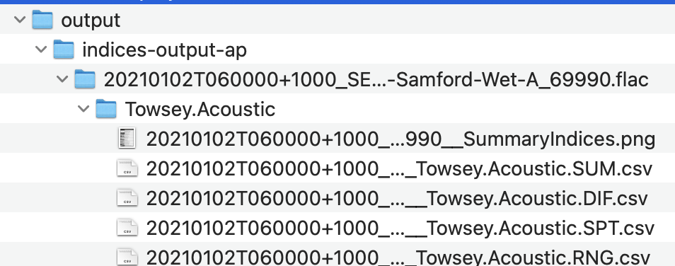

# Package stuff setup
```{r}
library(devtools)
library(roxygen2)
use_import_from("dplyr", "%>%")
```

# Todo
- fully workflow template
- generate spectrograms
- plots
- summary statistics
- maps showing study site locations 
- import metadata (temp, sensor locations, habitat type)
- Generate a summary description sentences and/or a markdown table (automatically generated using in-text R) based on the metadata. e.g. This site has <properties> and is located <sitelocation>. 
- a way to label / confirm motifs in R??

## Setup
```{r setup, include=FALSE}
knitr::opts_chunk$set(echo = TRUE)
```

## Install/reinstall
```{r}
detach("package:motifR", unload=TRUE)
install("/Users/andrew/Documents/Data Science/Projects/Ecoacoustics/motifR")
library(motifR)
```

## Terminology

- Site = a geographic region/area
- Location = an actual sensor

## Step 1 - prepare the acoustic indices data

### Download or provide your own data

In this example workflow we will use data available from the A2O.

If you would like to download data from the A20, follow this link: 

```{r}
list.files(path = "data/A2O/", recursive = TRUE)
```

TODO: run tree again in this directory (more files)
```
. ~/Projects/Ecoacoustics/motifR/data/A2O
├── 253_SEQPSamfordDryA
│   ├── 20210101T140000+1000_SEQP-Samford-Dry-A_69038.flac
│   ├── 20210101T180000+1000_SEQP-Samford-Dry-A_69039.flac
│   ├── 20210102T000000+1000_SEQP-Samford-Dry-A_69041.flac
│   └── 20210102T060000+1000_SEQP-Samford-Dry-A_69040.flac
└── download_audio_files.ps1
```

See some summary information about the files you're working with. My files are from 2021-01-01 to 2021-01-02. From one site, and two locations within that site.  
```{r}
#TODO: nice summary info, number of recordings/files, total hours, total sites etc
```

### Calculate acoustic indices

We will now calculate acoustic indices using a wrapper function to call the `AnalysisPrograms` software. At the moment, `motifR` supports the folder structure that is generated by `AP` only. In the future, different folder structures may be supported. Note: If you have already generated indices with AP you can skip this step. Or else you can generate the indices directly in your terminal with AP. 

#### Check if AP is available

Problem: The path in RStudio terminal doesn't match the path in the system terminal. I can call `AP` in a terminal, but not in Rstudio terminal. The PATH imported into Rstudio, Rstudio terminal, both seem to be different. Run `Sys.getenv("PATH")` in an Rmarkdown document, and then run `echo $PATH` in Rstudio terminal. Using the below code adds `/Users/andrew/.local/bin` to my path for Rstudio but not Rstudio terminal. This is the path to AP for my system (based on the automatic installer for AP). Still need to test this flow on windows.  

Check your value for path in R terminal. echo $PATH and compare to a real terminal. 

```{r}
# check a package you know should be available on your path
find_program("ffmpeg")

# check if AP is available
find_program("AP")

# if you have installed AP but the above does not work, use the code below:
old_path <- Sys.getenv("PATH")
Sys.setenv(PATH = paste(old_path, "/Users/andrew/.local/bin", sep = ":"))

# now check AP again
#find_program("AP")
```

Now we can easily run AP commands in R: 
```{r}
#AP("-help")
```

#### Errors in sound files - what happens?

Lets generate indices. All audio should be in one folder per study site (i.e. recorder location).
```{r}
#AP_prepare("data/A2O_with_errors/", "output/indices-output-ap")
```

You might notice in the above example I used the input directory `A2O_with_errors/`. This is data that I downloaded fresh from A2O. But I called it this because I tried to run AP and already know it has errors, and wanted to keep it as is to demonstrate what happens if you come across this issue. The error given is: `System.FormatException: Failed parsing 'N/A' to get FORMAT duration.` 
Nowadays, all files uploaded to A2O are automatically checked for errors and fixed. But older files may still have errors. These files are from January 2021 and have an issue. But don't worry, it is fixable and I will show you how. If your files are OK you can skip this step. 

We can run emu:
```{r}
# get the metadata from a2O files and output as a .csv

# fix broken audio files
# pay attention to the ' (doesn't work in mac for some reason) and directory structure. use backslashes to escape a space. use cd to check if your path is correct. 
#cd ~/Documents/Data\ Science/Projects/Ecoacoustics/motifR/data/A2O/

# check the files
#./emu fix check --all ~/Documents/Data\ Science/Projects/Ecoacoustics/motifR/data/A2O/**/*.flac

# the files have the FL010 metadata bug

# fix the files (dry run)
#./emu fix apply -f FL010 --dry-run ~/Documents/Data\ Science/Projects/Ecoacoustics/motifR/data/A2O/**/*.flac

# real run
#./emu fix apply -f FL010 ~/Documents/Data\ Science/Projects/Ecoacoustics/motifR/data/A2O/**/*.flac
```

#### Generating indices on fixed sound files

Now that I've fixed the files, i'll try to run AP analysis again. This will take some time. If you had errors, clear the `indices-output` folder before running this step on your fixed audio. Remember that AP generates values for acoustic indices based on each 1 minute segment of audio.

```{r}
AP_prepare("data/A2O-mini-test-rename", "output/indices-output-ap-mini")
```




## Step 2 - Time series
Construct a time series for the acoustic indices

Motifs have to be run ecosystems and months separately.

```{r}
# Notes from time_series.R to remember: ======

# next we run the motif analysis based on a geographic and month subset
# loop and make big df with all
# subset into geo and month id
# drop columns and get 1 df per index
# run hime per month, per geo, per index - keep DF as is and when doing hime, subset what you want and then run (but it has to be ordered - ordering files function - date, time, result minutes)
# hime takes .txt files
# hime runs on pwsh from R
# have to save the results files from hime
# can output everything in same directory
# set seed - when randomizing the labels etc for reproducible example important to set seed
# if they want to try follow they should get exactly same result, for RF and everything.
```

```{r}
# run the time_series
# output is a data frame of all indices data combined
# but this function also creates a folder, which stores the subset indices data that will be used for HIME input

testing <-
        motifR::time_series(indicesfolder = "backup/indices-output-ap", 
                    outputfolder = "output/timeseries")

```
`-- up to this point is working --`

## Step 3 - HIME
Starts with hime, hime processing, and then hime_processing_cont

```{r}
# we can pass our own path 
run_hime(timeseriesdata = "output/timeseries", 
         himeoutput = "output/hime", 
         himepath = "~/HIME/bin/HIME_release.jar")

# or leave out himepath to use the default location of hime in your project working directory
# run_hime(timeseriesdata, himeoutput)
```

## Step 4 - hime clean up
